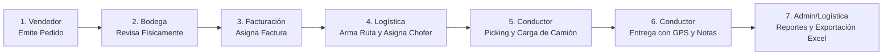

# 📖 EcoLogística Express — Guía Oficial de Usuario & Despliegue

Bienvenido al manual operativo de **EcoLogística ERP/WMS**. Este documento detalla las credenciales de acceso seguras, el flujo de trabajo en tiempo real paso a paso para cada uno de los roles, y la guía definitiva para **publicar la aplicación en internet** para que los conductores en la calle y el personal en oficina trabajen sincronizados en tiempo real y puedan generar reportes.

---

## 🔐 1. Credenciales de Acceso Oficiales

Se han configurado contraseñas seguras y robustas (combinando mayúsculas, minúsculas, números y caracteres especiales) para los **7 usuarios oficiales**:

| Rol | Nombre Completo | Usuario (Login) | Contraseña Segura | Teléfono | Vehículo Asignado |
| :--- | :--- | :--- | :--- | :--- | :--- |
| **👑 Administrador** | Lic. Roberto Méndez | `admin` | `Admin#EcoLog2026` | +505 8888-0001 | Supervisión Global |
| **💼 Vendedor 1** | Carlos Gómez | `carlos.ventas` | `Ventas1*Eco2026` | +505 8456-7890 | Oficina / Ventas |
| **💼 Vendedor 2** | María López | `maria.ventas` | `Ventas2*Eco2026` | +505 8521-9988 | Oficina / Ventas |
| **🚚 Conductor 1** | Juan Martínez | `juan.chofer` | `Chofer1!Eco2026` | +505 8899-1122 | Camión Hino 3.5T (M-32091) |
| **🚚 Conductor 2** | Pedro Sánchez | `pedro.chofer` | `Chofer2!Eco2026` | +505 8765-4321 | Panel Isuzu 1.5T (M-41088) |
| **🧾 Facturadora** | Ana Morales | `ana.factura` | `Factura$Eco2026` | +505 8222-3344 | Facturación Fiscal |
| **🗺️ Logístico** | Roberto Díaz | `roberto.logistica` | `Logistica%Eco2026` | +505 8111-2233 | Planificación de Rutas |
| **📦 Bodeguero (Aux)** | Mario Rivas | `mario.bodega` | `Bodega#Eco2026` | +505 8333-4455 | Bodega Central |

---

## 🖥️ 2. Cómo Entrar al Sistema

1. Abre tu navegador web (Google Chrome, Microsoft Edge, Safari o navegador del celular).
2. Ingresa a la dirección de la app:
   - **En tu computadora local:** `http://localhost:3000`
   - **En la red local Wi-Fi (celulares conectados al mismo router):** `http://IP_DE_TU_PC:3000` (Ej: `http://192.168.1.15:3000`)
   - **En internet (producción):** Tu enlace público (ej: `https://tu-logistica.onrender.com`).
3. Ingresa tu **Usuario** y **Contraseña** según la tabla anterior y presiona **Iniciar Sesión**.

---

## 🔄 3. Flujo Operativo en Tiempo Real (Paso a Paso)

El sistema sincroniza automáticamente cada **4 segundos** todas las pantallas, asegurando que cuando alguien hace un cambio, todos lo vean al instante.



---

### Paso 1: Ventas (`carlos.ventas` o `maria.ventas`)
1. Ve a la pestaña **`Emitir Pedido`**.
2. Escribe el número de documento (Ej: `PROF-2026-001` o `FAC-1001`).
3. Selecciona si es **Proforma** (irá a bodega y luego a facturación) o **Factura Directa**.
4. Escribe el nombre o código del cliente en el buscador interactivo.
5. Selecciona los productos del catálogo, define la cantidad y haz clic en **`+ Añadir Ítem`**.
6. Haz clic en **`Enviar Pedido a Revisión Física en Bodega`**.

---

### Paso 2: Bodega (`mario.bodega` o `admin`)
1. Ingresa a la pestaña **`Verificación Bodega`**.
2. Verás las tarjetas de pedidos pendientes.
3. El bodeguero revisa los productos físicamente en anaquel y marca las casillas de verificación.
4. Presiona **`Aprobar Inventario Físico Completo`**.
   - Si era Proforma, pasa automáticamente a Facturación.
   - Si era Factura Directa, queda lista para asignarse a una ruta.

---

### Paso 3: Facturación (`ana.factura`)
1. Ingresa a la pestaña **`Facturación Fiscal`**.
2. Verás las proformas verificadas por bodega.
3. Escribe el número de factura fiscal oficial definitivo (Ej: `FAC-2026-5501`).
4. Haz clic en **`Emitir Factura`**. El pedido queda inmediatamente en estado `FACTURA_LISTA_RUTA`.

---

### Paso 4: Logística (`roberto.logistica` o `admin`)
1. Ve a la pestaña **`Rutas & Despacho`**.
2. En la lista de facturas listas, marca las casillas de los pedidos que irán en el viaje y define el número de parada (1, 2, 3...).
3. En el desplegable superior, **selecciona el Conductor Asignado** (ej: *Juan Martínez* o *Pedro Sánchez*).
4. Presiona **`Generar Ruta & Hoja de Picking`**.
5. *(Opcional)* Si hay que recoger mercadería en un proveedor, usa el panel derecho **`Añadir Parada Extra (Recolección)`** para incluirla en la secuencia de paradas de la ruta.

---

### Paso 5: Conductor (`juan.chofer` o `pedro.chofer`)

Este módulo está adaptado para teléfonos inteligentes y tablets que los choferes llevan en la cabina del camión:

#### A. Hoja de Picking Consolidada (Carga del Camión)
1. El conductor ingresa a **`Mis Rutas & Picking`** y ve su ruta activa (ej: `Ruta #RUT-101`).
2. En la sección **`Hoja de Picking Consolidada`**, el chofer ve la **suma total de productos de toda su ruta** (por ejemplo: si 3 clientes pidieron 5, 10 y 15 unidades de detergente, verá *Total a subir: 30 unidades*).
3. Conforme va subiendo cada producto a la plataforma del camión, **marca la casilla en su pantalla**.
4. La **barra de progreso** visual avanza en tiempo real (0% ➔ 50% ➔ 100%).
5. Una vez todo arriba, presiona **`Confirmar Carga del Vehículo e Iniciar Ruta`**. La ruta pasa a estado `EN_RUTA`.
6. Si necesita el documento físico con sellos, presiona **`Imprimir Picking / Manifiesto`** (formato A4 listo para imprimir o guardar en PDF con espacios de firma).

#### B. Secuencia de Entregas y Registro de Notas
1. En la sección **`Secuencia de Entregas & Clientes`**, las paradas aparecen en orden (Parada 1, Parada 2, etc.).
2. Para llegar al cliente, el chofer toca el botón rojo **`Google Maps`** o el celeste **`Waze GPS`** para navegación guiada en vivo.
3. Al llegar y entregar los paquetes, toca el botón **`Confirmar Entrega / Registrar Notas de Entrega`**:
   - Selecciona: **Conforme** (`ENTREGADO`), **Con Incidencia** (`INCIDENCIA`) o **No Entregado** (`NO_ENTREGADO`).
   - Escribe en el campo de texto las **Notas del Conductor** (Ejemplo: *"Recibió encargada de compras Lic. Sofía con sello oficial de recepción"*, o *"Cliente solicitó volver por la tarde, portón cerrado"*).
   - Toca **`Confirmar Entrega`**.
4. Las notas se guardan con hora exacta y son visibles de inmediato en el panel de control.
5. Al completar la última parada, la ruta finaliza automáticamente.

---

### Paso 6: Administrador (`admin`)
1. **Métricas en Vivo (KPIs):** Cuadros superiores con conteo en tiempo real de pedidos en bodega, por facturar, en ruta y entregados.
2. **Gestión de Personal:**
   - Ve a la pestaña **`Personal & Usuarios`**.
   - Haz clic en **`Nuevo Conductor o Vendedor`** para registrar personal (Nombre, Usuario, Contraseña, Rol, Teléfono y Placa del Vehículo para choferes).
   - Elimina personal con el botón del basurero rojo si ya no labora en la empresa.
3. **Exportación de Reportes y Respaldo:**
   - En la barra superior derecha, junto a tu nombre de usuario, encontrarás dos botones directos:
     - 📊 **`Reporte Excel`**: Descarga inmediata de un archivo `.csv` con todas las órdenes, rutas, clientes, conductores, estados y las **notas registradas por los choferes**. Puedes abrirlo directamente en Microsoft Excel para liquidaciones y estadísticas.
     - 💾 **`Respaldo BD`**: Descarga el archivo de base de datos `.json` para tener una copia de seguridad en tu computadora.

---

## 🌐 4. Cómo Publicar la App en Internet (Paso a Paso)

Para que tus conductores puedan abrir la app en sus teléfonos celulares desde cualquier parte de la ciudad y oficina sin estar conectados a la misma red Wi-Fi, debes publicarla en la nube. A continuación tienes las 2 mejores formas:

### Opción A: Despliegue Gratuito en la Nube con Render.com (Recomendado)

Render ofrece hosting gratuito con HTTPS (candado de seguridad) y despliegue automático desde GitHub.

#### Pasos:
1. **Subir tu proyecto a GitHub:**
   - Abre una terminal en tu carpeta de proyecto:
     ```powershell
     git init
     git add .
     git commit -m "Sistema EcoLogistica listo para produccion"
     ```
   - Crea un repositorio en [GitHub.com](https://github.com) (privado o público) y sube tu código:
     ```powershell
     git remote add origin https://github.com/TU_USUARIO/TU_REPOSITORIO.git
     git branch -M main
     git push -u origin main
     ```

2. **Crear el servicio en Render:**
   - Entra en [Render.com](https://render.com) y regístrate gratis con tu cuenta de GitHub.
   - En el dashboard, haz clic en **New +** ➔ **Web Service**.
   - Selecciona tu repositorio de GitHub `logistica-app`.
   - Configura estos valores sencillos:
     - **Name:** `ecologistica-app` (o el nombre que elijas)
     - **Region:** Ohio (US East) o Frankfurt
     - **Branch:** `main`
     - **Runtime:** `Node`
     - **Build Command:** `npm install`
     - **Start Command:** `node server.js`
     - **Instance Type:** `Free`
   - Haz clic en **Create Web Service**.

3. **¡Listo!**
   - En unos 2 minutos, Render te dará un enlace seguro con HTTPS:
     `https://ecologistica-app.onrender.com`
   - Comparte este enlace con tus conductores y personal de ventas. Funcionará desde cualquier teléfono móvil con internet (Android / iPhone) y computadoras de escritorio.

---

### Opción B: Probar de inmediato en celulares con Cloudflare Tunnel o Ngrok (Sin subir a la nube)

Si quieres que los conductores prueben la app en sus teléfonos hoy mismo mientras corre en tu laptop:

1. Descarga [ngrok](https://ngrok.com/) o ejecuta en PowerShell:
   ```powershell
   npx ngrok http 3000
   ```
2. Te dará una URL pública temporal (ej: `https://a1b2-c3d4.ngrok-free.app`).
3. Abre esa URL en cualquier celular y podrás iniciar sesión como chofer y hacer pruebas en la calle.

---

### Opción C: Servidor VPS Dedicado (DigitalOcean / AWS / Hostinger)

Para un entorno empresarial corporativo de alto tráfico:
1. Contrata un VPS Ubuntu (desde \$4-\$6 USD/mes).
2. Instala Node.js y **PM2** (administrador de procesos para que nunca se apague):
   ```bash
   npm install -g pm2
   pm2 start server.js --name "ecologistica"
   pm2 startup
   pm2 save
   ```
3. Configura Nginx como Reverse Proxy hacia el puerto `3000`.
4. Instala certificado SSL gratuito con Let's Encrypt:
   ```bash
   sudo certbot --nginx -d tu-dominio.com
   ```

---

## 💾 5. Respaldo y Reportes Periódicos

1. **Liquidación Diaria:**
   - Al final de la jornada, el Administrador o Logística hace clic en **`Reporte Excel`** en la barra superior.
   - Abre el archivo descargado en Excel para verificar:
     - Cuántos pedidos fueron entregados conformes.
     - Qué incidencias o retrasos reportaron los conductores en sus notas.
     - Las firmas en los manifiestos impresos.
2. **Copia de Seguridad Semanal:**
   - Haz clic en el botón **`Respaldo BD`** para descargar el archivo `backup_ecologistica_YYYY-MM-DD.json` y guardarlo en una carpeta segura o Google Drive.

---
*EcoLogística Express — Sistema WMS/ERP en Tiempo Real.*
